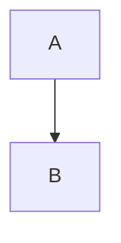
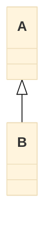
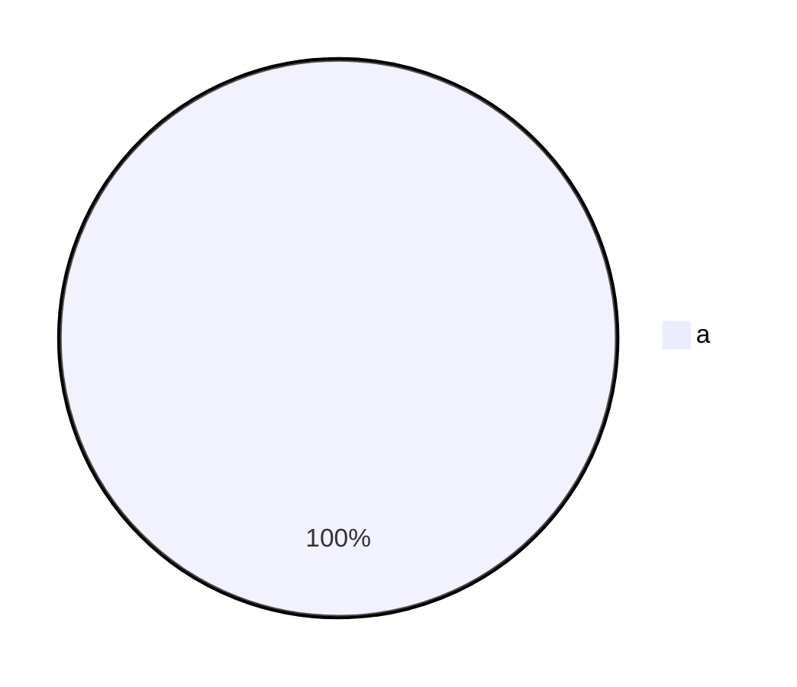

# Doc

## 2. Lifecycle


```mermaid
flowchart TD
  A --> B
```

### Spec 1: Contract

```yaml
# not a diagram
key: value
```


```mermaid
%%{init: {"theme": "base"}}%%
classDiagram
  A <|-- B
```

~~~
# Fake heading inside a fence
~~~

## Appendix


```mermaid
pie
  "a": 1
```
