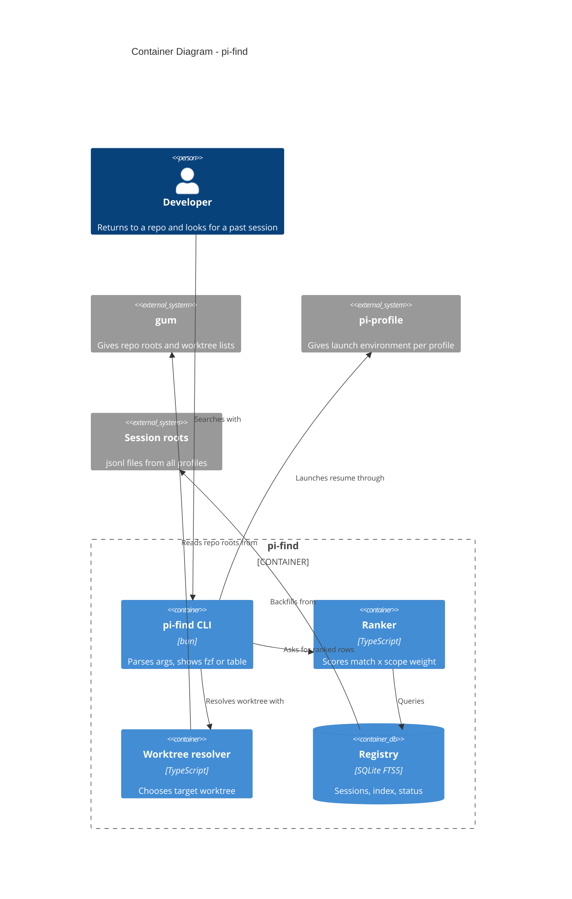

# pi-find architecture (C4 container view)

```mermaid
C4Container
  title Container Diagram - pi-find

  Person(user, "Developer", "Returns to a repo and looks for a past session")
  System_Ext(gum, "gum", "Gives repo roots and worktree lists")
  System_Ext(piprofile, "pi-profile", "Gives launch environment per profile")

  Container_Boundary(pf, "pi-find") {
    Container(cli, "pi-find CLI", "bun", "Parses args, shows fzf or table")
    Container(rank, "Ranker", "TypeScript", "Scores match x scope weight")
    Container(resolver, "Worktree resolver", "TypeScript", "Chooses target worktree")
    ContainerDb(reg, "Registry", "SQLite FTS5", "Sessions, index, status")
  }
  System_Ext(roots, "Session roots", "jsonl files from all profiles")

  Rel(user, cli, "Searches with")
  Rel(cli, rank, "Asks for ranked rows")
  Rel(rank, reg, "Queries")
  Rel(reg, roots, "Backfills from")
  Rel(cli, resolver, "Resolves worktree with")
  Rel(resolver, gum, "Reads repo roots from")
  Rel(cli, piprofile, "Launches resume through")
```
